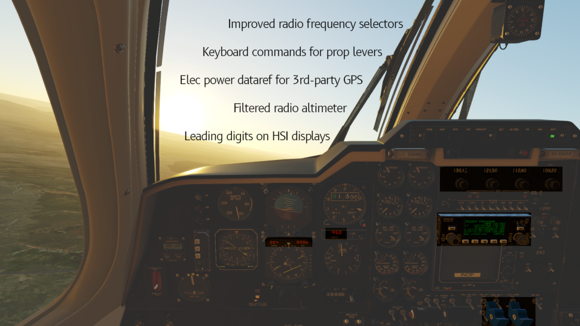

# MU-2 Tweaks

This is a Rust X-Plane plugin and guide to make some minor tweaks for the [TOGA Simulations MU-2](https://www.x-aviation.com/catalog/product_info.php/toga-simulations-marquise-p-226).

## Usage

- Compile this repo on a computer with Rust installed
- Place compiled plugin within MU-2 aircraft folder
- Follow [install instructions](./doc/InstallInstructions.md) to modify the MU-2 where necessary

## Target

- Latest X-Plane 12 version (currently 12.0.8)
- Latest MU-2 (currently 2.1.0)
- All OSes - which is easy in Rust via cross-compilation

## Features / Backlog

- [x] Radio altimeter less precise
- [x] GPS power dataref which respects fuse position
- [x] Commands to move condition levers directly to all labelled positions
- [x] Leading zeros for HSI course and distance digital displays
- [x] Roller-counter NAV/COM radios interoperable with other freq selectors
- [ ] Nicer roller counter animation
- [ ] Publish compiled plugins
